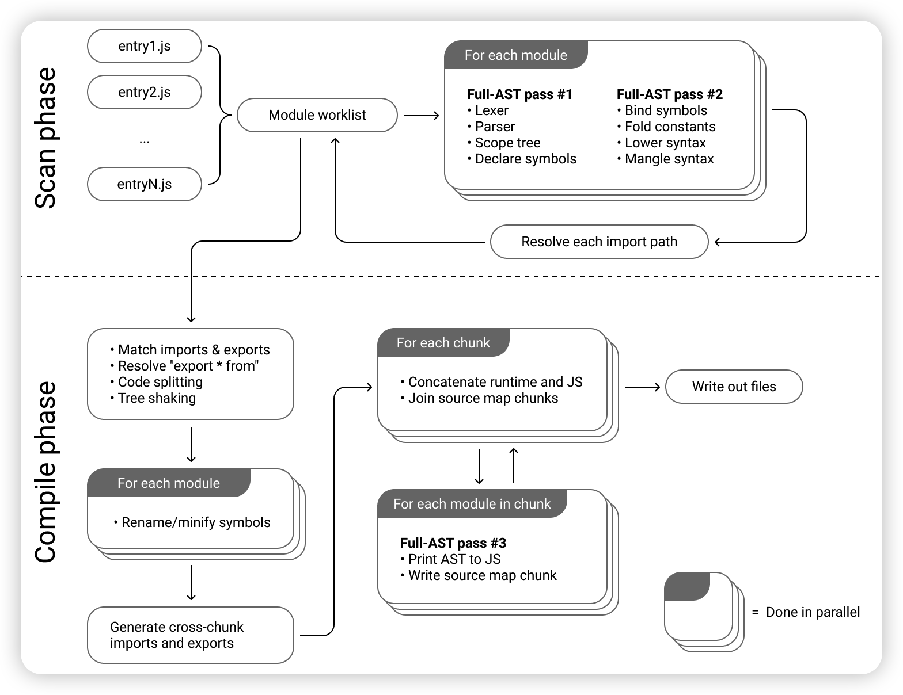
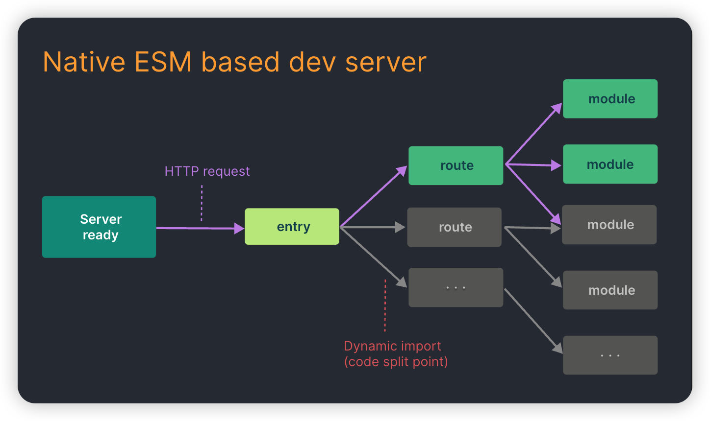
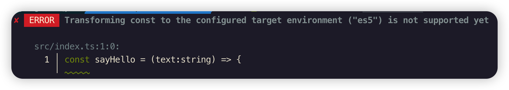
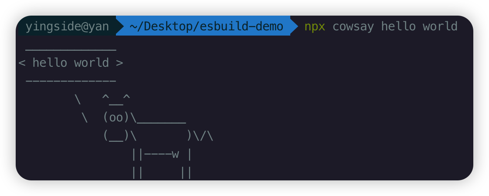
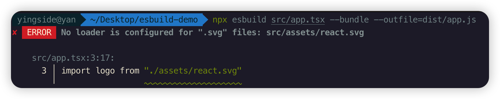
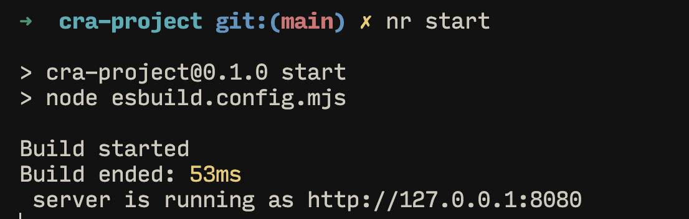

# 【开篇】esbuild 概述

专栏中的代码均在 http://github.com/sunny-117/esbuild-book

## 什么是[esbuild](https://esbuild.github.io/)？

`esbuild` 是一款基于 `Go` 语言开发的 `javascript` 构建打包工具，相比传统的构建工具，主打性能优势。同样规模的项目，使用 `Esbuild` 可以将打包速度提升 `10` - `100` 倍，这对广大一直饱受 `Webpack` 缓慢打包速度折磨的开发人员来说，简直就是福音。

下图为esbuild和其他的构建工具用默认配置打包10个three.js库所花费时间的对比：


## 为什么能这么快？

1. **Golang 开发**

采用 Go 语言开发，传统的JS开发的构建工具并不适合资源打包这种 CPU 密集场景下，Go更具性能优势。

2. **多核并行**

go具有多线程运行能力，而JS本质上就是一门单线程语言。由于go的多个线程是可以共享内存的，所以可以将解析、编译和生成的工作并行化。

3. **从零开始**

从一开始就考虑性能，不使用第三方依赖，从始至终是使用的是一致的数据结构，从而避免数据转换无意义的消耗。

4. **内存的有效利用**

在 JS 开发的传统打包工具当中一般会频繁地解析和传递抽象语法树( AST )数据，比如 `字符串 -> TS -> JS -> 字符串，然后字符串 -> JS -> 旧的JS -> 字符串，然后字符串 -> JS -> minified JS -> 字符串`，这其中会涉及复杂的编译工具链，比如 `webpack -> babel -> terser`，每次接触到新的工具链，都得重新解析 AST，导致大量的内存占用。

esbuild 仅触及整个JavaScript AST 3次：

1. 进行词法分析，解析，作用域设置和声明符号的过程
2. 绑定符号，最小化语法。比如：将 JSX / TS转换为 JS。
3. AST生成JS，source map生成。

当 AST 数据在CPU缓存中仍然处于活跃状态时，会最大化AST数据的重用。



## 为什么还没有一统江山？

虽然esbuild有很多优点，但是缺点也非常的明显，从esbuild的官方文档[upcoming roadmap](https://esbuild.github.io/faq/#upcoming-roadmap)中，就能看出下面的问题：

- **ESbuild 没有提供 AST 的操作能力，打包产物无法降级到 ES5 及以下，不能兼容一些低版本浏览器**
- **Code splitting 还在计划中**
- **没有TS的类型检测**
- **默认不支持vue，angular等代码文件格式**
- ......

简单来说，现在希望直接将esbuild放入到生产环境中，还需要一些路走，并不足以支撑一个大型项目的开发需求。有些内容虽然我们可以通过插件去实现，但是并不是开箱即用的功能，对于项目开发的新手来说，并不友好。变相增加了开发成本

## 为什么要学习esbuild?

无论如何，`esbuild`为我们所熟知，还是因为[**Vite**](https://cn.vitejs.dev/)，`esbuild`是组成`Vite`的两架马车之一。

下图描述了`Vite`的架构组成:


## 为什么Vite要使用esbuild？

一个字...快

现在来说，Vite在下面几个地方都依托于esbuild，而未来随着esbuild的完善，应该会做进一步处理

- **依赖预构建---作为 Bundle 工具**
- **单文件编译——作为 TS 和 JSX 编译工具**
- **代码压缩——作为压缩工具**

## 什么是no-bundle?

`ESM`是`JavaScript`提出的官方标准化模块系统，不同于之前的`CJS`，`AMD`，`CMD`等等，`ESM`提供了更原生以及更动态的模块加载方案，最重要的就是它是浏览器原生支持的，也就是说我们可以直接在浏览器中去执行`import`，动态引入我们需要的模块，而不是把所有模块打包在一起。

 Vite 是一个提倡 `no-bundle` 的构建工具，相比于传统的 Webpack，能做到开发时的模块按需编译，而不用先打包完再加载。




## 什么是依赖预构建？

模块代码其实分为两部分，一部分是源代码，也就是业务代码，另一部分是第三方依赖的代码，即`node_modules`中的代码。所谓的`no-bundle`只是对于源代码而言，对于第三方依赖而言，我们基本不会去改变他，Vite 还是选择 bundle(打包)，这个部分，就依赖于`esbuild`。

但是关键点是，为什么在开发阶段我们要对第三方依赖进行预构建? 如果不进行预构建会怎么样？

首先 Vite 是基于浏览器原生 ES 模块规范实现的 Dev Server，不论是应用代码，还是第三方依赖的代码，理应符合 ESM 规范才能够正常运行。但是，我们没有办法控制第三方的打包规范。还有相当多的第三方库仍然没有 ES 版本的产物。

此外，ESM还有一个比较重要的问题——**请求瀑布流问题**。ESM的每个`import`都会触发一次新的文件请求，因此在`依赖层级深`、`涉及模块数量多`的情况下，会触发很多个网络请求，巨大的请求量加上 **Chrome 对同一个域名下只能同时支持 6个 HTTP 并发请求的限制**，导致页面加载十分缓慢，与 Vite 主导性能优势的初衷背道而驰。

在进行**依赖的预构建**之后，这种第三方库的代码被打包成了一个文件，这样请求的数量会骤然减少，页面加载也快了许多


# 【快速上手】esbuild 命令行调用

使用 Esbuild 有 2 种方式，分别是 **命令行调用**和**代码调用**。

无论如何我先`npm init -y`创建一个新项目，然后通过如下的命令完成 Esbuild 的安装:

```javascript
npm i esbuild
```

查看esbuild版本

```javascript
./node_modules/.bin/esbuild --version
```

创建ts文件

```javascript
const sayHello = (text:string) => { 
  console.log(`hello ${text}`);
}
sayHello('world!');
```

ts文件编译,指定输出文件位置

```javascript
./node_modules/.bin/esbuild src/index.ts --outfile=dist/index.js
```

## 对比tsc的编译

```javascript
tsc src/index.ts
```

默认转成的是ES5语法

```javascript
var sayHello = function (text) {
    console.log("hello ".concat(text));
};
sayHello('world!');
```

可以给一些参数

```javascript
tsc src/index.ts --target es6 --outFile dist/index.js
```

其实esbuild也能指定ES的转换版本

```javascript
./node_modules/.bin/esbuild src/index.ts  --outfile=dist/index.js --target=esnext
```

但是注意，esbuild只支持es6以上的版本，因此，如果你指定es5的版本，就会报出如下的错误

```javascript
./node_modules/.bin/esbuild src/index.ts  --outfile=dist/index.js --target=es5
```



关键是要看执行了多少时间

```javascript
time tsc src/index.ts --target es6 --outFile dist/index.js
```

> **注意**：**time为liunx命令**，这里只是演示时间效果，windows系统上不能复现这个命令效果不用强求

## npx 软件包运行器

如果你想执行一个本地安装的软件包，你只需要输入：

```bash
$ npx your-package
```

npx 将检查 `<command>` 或 `<package>` 是否存在于 `$PATH` 或本地项目的二进制文件中，如果存在，npx 将执行它。

上面的代码可以直接简写为

```javascript
npx esbuild src/index.ts --outfile=dist/index.js
```

## 执行以前没有安装的软件包

npx甚至能够执行以前没有安装的软件包。

让我们通过运行来测试一下：

```bash
$ npx cowsay hello world	
```



## bundle

```javascript
npx src/index.ts  --outfile=dist/index.js --target=es6 --bundle
```

当`--bundle`启用后，默认输出[格式](https://esbuild.github.io/api/#format)设置为`iife`，它将生成的 JavaScript 代码包装在立即调用的函数表达式中，以防止变量泄漏到全局范围内。

这样看着不是太明显，我们可以导入react相关包，模拟一下相关打包情况

```javascript
npm install react react-dom @types/react @types/react-dom
```

**App.tsx**

```javascript
import * as React from 'react'
import * as Server from 'react-dom/server'

let Greet = () => <h1>Hello, world!</h1>
console.log(Server.renderToString(<Greet />))
```

我们可以直接将这个tsx文件进行编译打包，你会看到，包括react的相关内容，也都会打包到生成的文件中

```javascript
npx esbuild src/app.tsx --outfile=dist/app.js --bundle
```

当然，如果你想压缩的话，也可以很简单的加上`--minify`属性

```javascript
npx esbuild src/app.tsx --outfile=dist/app.js --bundle --minify
```

## [Content Types](https://esbuild.github.io/content-types/)

但是这里你需要留意一个问题，tsx其实是react的语法后缀，但是esbuild也能直接进行默认编译。esbuild内置了内容类型，每个内容类型都有一个关联的**“加载器”-loader**。它告诉 esbuild 如何解释文件内容。默认情况下，某些文件扩展名已经为其配置了加载器

比如，如果后缀名是`tsx`或者`jsx`，就会自动的加载**jsx loader**加载器。换句话说，如果后缀名不为`tsx`或者`jsx`，我们可以手动的为其设置加载器loader

测试：`text.ts`,**下面的jsx代码肯定会报错**，不过这里不纠结，直接在编译的时候，使用loader进行转换

```javascript
import * as React from 'react'
import * as Server from 'react-dom/server'

let Greet = () => <h1>Hello, world!</h1>
console.log(Server.renderToString(<Greet />))
```

```javascript
npx esbuild src/test.ts --bundle --outfile=dist/test.js --loader:.ts=tsx
```

当然有一些并非默认就可以直接处理的，比如图片，我们加入张图片到`app.tsx`的代码中

```javascript
import * as React from 'react'
import * as Server from 'react-dom/server'
import logo from "./assets/react.svg"

let Greet = () => (
  <div>
    
    <h1>Hello, world!</h1>
  </div>
  
)
console.log(Server.renderToString(<Greet />))
```

由于我们并没有工程化的导入react工程，因此TS类型肯定会有一些问题，我们可以简单的引入一下svg的类型，直接在根目录下创建`types.d.ts`文件，声明图片类型

```javascript
declare module '*.svg' {
  const src: string
  export default src
}
declare module '*.png' {
  const src: string
  export default src
}
declare module '*.jpg' {
  const src: string
  export default src
}
declare module '*.jpeg' {
  const src: string
  export default src
}
declare module '*.gif' {
  const src: string
  export default src
}
declare module '*.ico' {
  const src: string
  export default src
}
declare module '*.webp' {
  const src: string
  export default src
}
declare module '*.avif' {
  const src: string
  export default src
}
```

一般情况下，我们通过脚手架创建的项目，其实都会有一个类似于`react-app-env.d.ts`或者 `vite-env.d.ts`文件，里面内容大致如下：

```javascript
/// <reference types="react-scripts" />
或者
/// <reference types="vite/client" />
```

你可以在对应的types声明文件中找到相应的类型声明

无论怎么样，加入了图片之后，再通过esbuild直接打包，就会报错



对于一些简单的图片，我们可以直接通过[data url](https://esbuild.github.io/content-types/#data-url)来进行处理，加上下面的属性，可以把svg图片转换为

```javascript
npx esbuild src/app.tsx --outfile=dist/app.js --bundle --loader:.svg=dataurl
```


# 【应用实践】esbuild 代码调用

命令行的操作当需要配置的内容过多是，太繁琐了。因此我们当然可以像其他工具一样，进行配置化的操作。

Esbuild 对外暴露了一系列的 API，主要包括两类: `Build API`和`Transform API`，我们可以在 Nodejs 代码中通过调用这些 API 来使用 Esbuild 的各种功能。

## 项目打包——Build API

`Build API`主要用来进行项目打包，包括`build`、`buildSync`和`context`三个方法。

我们可以在项目根目录下创建`esbuild.config.mjs`文件来进行处理

```javascript
import esbuild from "esbuild";
esbuild.build({
  // 入口文件列表，为一个数组
  entryPoints: ['src/app.tsx'],
  // 是否需要打包，一般设为 true
  bundle: true,
  // 是否进行代码压缩
  minify: false,
  // 是否生成 SourceMap 文件
  sourcemap: true,
  // 指定语言版本和目标环境
  target: ['es2020', 'chrome58', 'firefox57', 'safari11'],
  // 指定输出文件
  outfile: './public/dist/app.js',
  // 指定loader
  loader: {
    ".svg": "dataurl",
  }
})
```

`buildSync`和`build`唯一的不一样就是这个方法是同步的，个人并不推荐使用`buildSync`这种同步的 API，它们会导致两方面不良后果。一方面容易使 Esbuild 在当前线程阻塞，丧失`并发任务处理`的优势。另一方面，Esbuild 所有插件中都不能使用任何异步操作，这给`插件开发`增加了限制。

为了让大家看到完整的效果，我们可以重新处理一下代码：

```javascript
import React from 'react';
import ReactDOM from 'react-dom/client'
import Comp1 from 'components/Comp1';
import Comp2 from 'components/Comp2';

const App = () => (<div>
  <h1>Hello World!</h1>
  <Comp1 />
  <Comp2 />
</div>);

ReactDOM
  .createRoot(document.getElementById('root')!)
  .render(<App />)
```

为了看到效果，多写了2个组件

```javascript
// components/Comp1.tsx
import React from 'react';
export default () => { 
  return (<>
    <h1>Comp1</h1>
    <ul>
      <li>vite</li>
      <li>esbuild</li>
      <li>rollup</li>
    </ul>
  </>)
}
```

```javascript
// components/Comp2.tsx
import React from 'react';
import logo from "../assets/react.svg"

export default () => { 
  return (<>
    <h1>Comp2</h1>
    
  </>)
}
```

然后我们就可以利用`node`去运行`esbuild.config.mjs`文件，然后对文件进行打包处理了

```javascript
node esbuild.config.mjs
```

打包好之后的文件，我们可以用index.html去调用对应的js文件即可

```javascript
<!DOCTYPE html>
<html lang="en">
<head>
  <meta charset="UTF-8">
  <meta name="viewport" content="width=device-width, initial-scale=1.0">
  <title>Document</title>
</head>
<body>
  <div id="root"></div>
  <script src="dist/app.js"></script>
</body>
</html>
```

利用`http-server`运行一下

```javascript
 npx http-server -o -c-1
// -o 立即打开浏览器
// -c-1 清空http-server缓存
```

## 引入css

```javascript
// src/style.css
body{
  color:black;
  font-size:26px;
}
.title{
  color:blue;
  font-size:40px;
}
```

```javascript
// app.tsx
import "./style.css"

const App = () => (<div>
  <h1 className="title">Hello World!!</h1>
  <Comp1 />
  <Comp2 />
</div>);
```

最后打包出来的css文件名和app组件同名，所以最好css的名字不要和组件同名。

和打包之后的js一样，并不会自动放到index.html上，需要我们自己放上去

```javascript
<link rel="stylesheet" href="dist/app.css">
```

如果是在其他组件内引入的css，一样会打包到app.css中，比如在`Comp1.tsx`中引入css

```javascript
// components/comp.css
ul{
  list-style: none;
}
li{
  border: 1px solid #ccc;
}

// components/Comp1.tsx
import React from 'react';
import "./comp.css"

export default () => { 
  return (<>
    <h1>Comp1</h1>
    <ul>
      <li>vite</li>
      <li>esbuild</li>
      <li>rollup</li>
    </ul>
  </>)
}
```

我们也可以引入CSS modules预处理器，以便组件的css样式与全局css样式冲突

```javascript
// components/comps.module.css
.title{
  color:yellow;
}

// components/Comp2.tsx
import React from 'react';
import logo from "../assets/react.svg"
import comps from "./comps.module.css";

export default () => { 
  return (<>
    <h1 className={comps.title}>Comp2</h1>
    
  </>)
}
```

需要在配置中加上`css module` 的`loader`加载器

```javascript
loader: {
	".module.css": "local-css",
},
```

## 引入Html

之前都是直接将html写死在打包好的文件夹中，其实也可以直接打包已有的html文件

在src目录下创建index.html文件

```javascript
<!DOCTYPE html>
<html lang="en">
<head>
  <meta charset="UTF-8">
  <meta name="viewport" content="width=device-width, initial-scale=1.0">
  <title>Document</title>
  <link href="./app.css" rel="stylesheet">
</head>
<body>
  <div id="root"></div>
</body>
<script src="./app.js"></script>
</html>
```

```javascript
import esbuild from 'esbuild';
esbuild.build({
  // 入口文件列表，为一个数组
  entryPoints: ['src/app.tsx','src/index.html'],
  // 是否需要打包，一般设为 true
  bundle: true,
  // 是否进行代码压缩
  minify: false,
  // 是否生成 SourceMap 文件
  sourcemap: true,
  // 指定语言版本和目标环境
  target: ['es2020', 'chrome58', 'firefox57', 'safari11'],
  // 是否生成打包的元信息文件
  metafile: true,
  // 指定输出文件
  outdir: './public/dist/',
  // 指定loader
  loader: {
    ".html": "copy",
    ".svg": "dataurl",
    ".module.css": "local-css",
  }
})
```


## [插件](https://esbuild.github.io/plugins/#finding-plugins)

Esbuild 的时候难免会遇到一些需要加上自定义插件的场景，并且 Vite 依赖预编译的实现中大量应用了 Esbuild 插件的逻辑，你可以到[现有 esbuild 插件列表](https://github.com/esbuild/community-plugins)中去查找已有的esbuild插件，比如，之前对于图片和css的处理。[内联图像插件](https://github.com/natrim/esbuild-plugin-inline-image)，[css插件](https://github.com/Inqnuam/esbuild-plugin-class-modules)

```javascript
// 导入
npm install esbuild-plugin-inline-image
npm install -D esbuild-plugin-class-modules

// 使用
import inlineImage from "esbuild-plugin-inline-image";
import classModules from "esbuild-plugin-class-modules";

esbuild.build({
  ...
  plugins: [
    ...
    inlineImage(),
    classModules()
  ]
  ...
});
```

## 元数据分析

`esbuild.build`是一个异步函数，我们还可以拿到这个函数的返回值，根据这个返回值，我们还能进行元数据的分析

```javascript
import esbuild from "esbuild";
import inlineImage from "esbuild-plugin-inline-image";
(async () => { 
  const result = await esbuild.build({
    // 入口文件列表，为一个数组
    entryPoints: ['src/app.tsx'],
    // 是否需要打包，一般设为 true
    bundle: true,
    // 是否进行代码压缩
    minify: false,
    // 是否生成 SourceMap 文件
    sourcemap: true,
    // 指定语言版本和目标环境
    target: ['es2020', 'chrome58', 'firefox57', 'safari11'],
    // 是否生成打包的元信息文件
    metafile: true,
    // 指定输出文件
    outfile: './public/dist/app.js',
    // 指定loader
    // loader: {
    //   ".svg": "dataurl",
    // },
    plugins: [
      inlineImage()
    ]
  })

  console.log(result);

  // 打印详细的元信息
  const text = await esbuild.analyzeMetafile(result.metafile, {
    verbose: true, 
  });

  console.log(text);
})();
```


## context


在项目打包方面，除了`build`和`buildSync`，Esbuild 还提供了另外一个比较强大的 API——`context`

`context`为我们提供了三种可以增量构建的API，注意`context`和下面的API**都是异步的**

- [**Watch mode**](https://esbuild.github.io/api/#watch) 简单来说就是监听模式，当我们修改源文件的时候，会自动帮我们重建
- [**Serve mode**](https://esbuild.github.io/api/#serve) 启动本地开发服务器，提供最新构建的结果。注意，Serve mode会自动帮我们构建打包源文件，但是并不支持热重载
- [**Rebuild mode**](https://esbuild.github.io/api/#rebuild) 允许手动调用构建。当将 esbuild 与其他工具集成时这非常有用。

```javascript
import esbuild from "esbuild";
import inlineImage from "esbuild-plugin-inline-image";
import classModules from "esbuild-plugin-class-modules";

(async () => {
  const ctx = await esbuild.context({
    // 入口文件列表，为一个数组
    entryPoints: ["src/app.tsx","src/index.html"],
    // 是否需要打包，一般设为 true
    bundle: true,
    // 是否进行代码压缩
    minify: false,
    // 是否生成 SourceMap 文件
    sourcemap: true,
    // 指定语言版本和目标环境
    target: ["es2020", "chrome58", "firefox57", "safari11"],
    // 指定输出文件
    // outfile: "./dist/app.js",
    outdir: "./dist",
    loader: {
      ".html": "copy",
    },
    plugins: [inlineImage(),classModules()],
  });

  // await ctx.watch();

  ctx
    .serve({
      servedir: "./dist",
      port: 8000,
      host: "localhost",
    })
    .then((server) => {
      console.log(`server is running at ${server.host}:${server.port}`);
    });
})();
```

## Live reload

实时重新加载是一种开发方法，您可以在浏览器与代码编辑器同时打开并可见。当您编辑并保存源代码时，浏览器会自动重新加载，并且重新加载的应用程序版本包含您的更改。这意味着您可以更快地迭代，因为您不必在每次更改后手动切换到浏览器、重新加载，然后切换回代码编辑器。

不过，esbuild并没有给我们提供实时重新加载的API，但是可以通过组合[监视模式Watch mode](https://esbuild.github.io/api/#watch)（和[服务模式Serve mode](https://esbuild.github.io/api/#serve)加上少量客户端 JavaScript 来构建实时重新加载仅在开发期间添加到应用程序的代码。

配置代码还是之前的不变，只是`watch()`和`serve()`函数同时打开，然后只需要在客户端html中加入下面的js代码即可

```javascript
<script type="module">
	new EventSource('/esbuild').addEventListener('change', () => location.reload())
</script>
```


# 【小试牛刀】将webpack替换成esbuild构建项目

使用`create-react-app`搭建项目，具体可去`cra`官网操作

在项目根目录，新建`esbuild.config.mjs`

安装`esbuild`相关依赖：

```shell
pnpm i esbuild esbuild-plugin-inline-image esbuild-plugin-time
```

```js
import esbuild from 'esbuild';
import inlineImage from 'esbuild-plugin-inline-image';
import time from 'esbuild-plugin-time'

(async () => { 
  const ctx = await esbuild.context({
    //入口列表
    entryPoints: ['src/index.js'],
    //输出目录
    outdir: './public',
    //是否需要打包
    bundle: true,
    //是否需要压缩
    minify: false,
    //是否需要sourcemap
    sourcemap: true,
    // 是否需要生成打包元信息
    metafile: true,
    //指定语言版本和目标环境
    target: ['es2020', 'chrome58', 'firefox57', 'safari11'],
    //指定loader
    loader: {
      ".js":"jsx",
      ".html":"copy",
      ".module.css":"local-css"
    },
    //插件
    plugins: [inlineImage(),time()],
  })

  await ctx.watch();

  ctx.serve({
    port: 8080,
    host: 'localhost',
    servedir: './public',
  }).then((server) => { 
    console.log(` server is running as http://${server.host}:${server.port}`);
  })

})();
```

更改 `package.json`

```json
"scripts": {
    "start": "node esbuild.config.mjs"
},
```

执行 `npm run start`




# 【API 总结】esbuild调用总结

## transform API

`transform/transformSync` 对单个字符串进行操作，不需要访问文件系统。非常适合在没有文件系统的环境中使用或作为另一个工具链的一部分，它提供了两个参数：

```javascript
transform(str: string, options?: Config): Promise<Result>
transformSync(str: string, options?: Config): Result
```

1. `str`：字符串（必填），指需要转化的代码
2. `options`：配置项（可选），指转化需要的选项

常用配置：

```javascript
interface Config {
  define: object # 关键词替换
  format: string # js 输出规范（iife/cjs/esm）
  loader: string | object # transform API 只能使用 string
  minify: boolean # 压缩代码，包含删除空格、重命名变量、修改语法使语法更简练
  # 通过以下方式单独配置，上述功能
  minifyWhitespace: boolean # 删除空格
  minifyIdentifiers: boolean # 重命名变量
  minifySyntax: boolean # 修改语法使语法更简练
  sourcemap: boolean | string
  target: string[] # 设置目标环境，默认是 esnext（使用最新 es 特性）
}
```

```javascript
// transform.mjs

import * as esbuild from 'esbuild'
const code = `
interface User{
  name: string;
  age: number;
}
let x: number = 1;
const getUserInfo = (user: User) => {
  console.log(user.name);
  console.log(user.age);
}
getUserInfo({name: 'jack', age: 18});
`

let result = await esbuild.transform(code, {
  loader: 'ts',
  // minify: true,
  // minifyWhitespace: true,
  // sourcemap: true,

})
console.log(result)
```

## 命令行调用

```javascript
# 入口文件 esbuild xxx/index.ts
# --outfile=xxx/xxx/js 输出文件
# --outdir=xxx/ 输出目录
# --bundle 打包
# --minify 压缩
# --target=esnext
# --loader:.png=dataurl 将 png 转换成dataurl的形式
```

## JS代码调用


```javascript
Build API
const config = {};
await esbuild.build(config);
esbuild.buildSync(config); //同步方法
//esbuild.watch()
//esbuild.serve()
const ctx = await esbuild.context(config) esbuid v.0.17
//监听文件
await ctx.watch();
//开发服务器
await ctx.serve({});
//重新打包
await ctx.rebuild();
```


### build API


Build API调用对文件系统中的一个或多个文件进行操作。这使得文件可以相互引用，并被编译在一起（需要设置`bundle: true`）

```javascript
build(options?: Config): Promise<Result>
buildSync(options?: Config): Result
```

**常用配置：**

```javascript
// ./node_modules/esbuild/lib/main.d.ts

interface CommonOptions {
  absWorkingDir: string # 当前项目根目录，可通过process.cwd()设置
  bundle: boolean # 将所有源码打包到一起
  entryPoints: string[] | object # 入口文件，通过对象方式可以指定输出后文件名，和 webpack 类似
  outdir: string # 输出文件夹，不能和 outfile 同时使用；多入口文件使用 outdir
  outfile: string # 输出的文件名，，不能和 outdir 同时使用；单入口文件使用 outfile
  outbase: string # 每个入口文件构建到不同目录时使用
  define: object # define = {K: V}  在解析代码的时候用V替换K 
  platform: string # 指定输出环境，默认为 browser 还有一个值是 node，
  format: string # js 输出规范（iife/cjs/esm），如果 platform 为 browser，默认为 iife；如果 platform 为 node，默认为 cjs
  splitting: boolean # 代码分割(当前仅限 esm模式,还在迭代中...)
  loader: string | object # transform API 只能使用 string
  minify: boolean # 压缩代码，包含删除空格、重命名变量、修改语法使语法更简练。其实就是下面三个配置的整合体minifyWhitespace，minifyIdentifiers，minifySyntax
  minifyWhitespace: boolean # 删除空格
  minifyIdentifiers: boolean # 重命名变量
  minifySyntax: boolean # 修改语法使语法更简练
  sourcemap: boolean | string
  target: string[] # 设置目标环境，默认是 esnext（使用最新 es 特性）
  jsxFactory: string # 指定调用每个jsx元素的函数
  jsxFragment: string # 指定聚合一个子元素列表的函数
  assetNames: string # 静态资源输出的文件名称（默认是名字加上hash）
  chunkNames: string # 代码分割后输出的文件名称
  entryNames: string # 入口文件名称
  treeShaking: boolean # 默认为true
  tsconfig: string # 指定 tsconfig 文件
  publicPath: string # 公共路径
  write: boolean # 默认 false，对于cli和js API，默认是写入文件系统中，设置为 true 后，写入内存缓冲区
  inject: string[] # 将数组中的文件导入到所有输出文件中
  metafile: boolean # 生成依赖图 
}
```

### 加载器(loader)

esbuild加载器的作用与webpack中loader作用类似，都是对于某种类型的文件进行编译

#### 1. [js-loader](https://esbuild.github.io/content-types/#javascript)

这个加载器默认用于.js、.cjs和.mjs文件。.cjs扩展名被node用于CommonJS模块，而.mjs扩展名被node用于ECMAScript模块，尽管esbuild并没有对这两者进行区分。

esbuild支持所有现代JavaScript语法。然而，较新的语法可能不被旧的浏览器所支持，所以你可能想配置目标选项，告诉esbuild将较新的语法转换为适当的旧语法。

> esbuild并不支持ES5的转换，目前还不支持将ES6+语法转换为ES5。

#### 2. [ts-loader](https://esbuild.github.io/content-types/#typescript)

`.ts`默认情况下为、`.tsx`、`.mts`和文件启用此加载器`.cts`，这意味着 esbuild 内置支持解析 TypeScript 语法并丢弃类型注释。但是，esbuild*不*执行任何类型检查

#### 3. [jsx-loader](https://esbuild.github.io/content-types/#jsx)

[JSX是 JavaScript 的类似 XML 的语法扩展，是为](https://facebook.github.io/jsx/)[React](https://github.com/facebook/react)创建的。它旨在由您的构建工具转换为普通的 JavaScript。每个 XML 元素都成为一个普通的 JavaScript 函数调用。例如，以下 JSX 代码：

```javascript
import Button from './button'
let button = <Button>Click me</Button>
render(button)
```

将被转换为以下 JavaScript 代码：

```javascript
import Button from "./button";
let button = React.createElement(Button, null, "Click me");
render(button);
```

> .jsx和.tsx会默认开启此loader，如果你的文件是.js结尾的，那么必须手动声明loader，比如：loader: { '.js': 'jsx' },

#### 4. [json-loader](https://esbuild.github.io/content-types/#json)

对于.json文件，这个加载器是默认启用的。它在构建时将JSON文件解析成一个JavaScript对象，并将该对象作为默认导出

#### 5. [css-loader](https://esbuild.github.io/content-types/#css)

#### 6. [text-loader](https://esbuild.github.io/content-types/#text)

#### 7. [binary-loader](https://esbuild.github.io/content-types/#binary)

#### 8. [Base64-loader](https://esbuild.github.io/content-types/#base64)

#### 9. [dataurl-loader](https://esbuild.github.io/content-types/#data-url)

#### 10. [file-loader](https://esbuild.github.io/content-types/#file)

#### 11. [copy-loader](https://esbuild.github.io/content-types/#copy)

该加载程序会将文件复制到输出目录，并重写导入路径以指向复制的文件。

## Context API

context API 是[**esbuild v0.17.0**](https://github.com/evanw/esbuild/releases/tag/v0.17.0)版本新加入的API，此版本不向后兼容。context函数本身可以配置`interface CommonOptions`中的所有内容

context API 主要替换了之前可以直接使用esbuild对象调用的`serve`，`watch`等函数。现在`serve`，`watch`等函数要通过context函数调用之后的对象获取，并且他们都已**异步**的。

- [**Watch mode**](https://esbuild.github.io/api/#watch) 简单来说就是监听模式，当我们修改源文件的时候，会自动帮我们重建
- [**Serve mode**](https://esbuild.github.io/api/#serve) 启动本地开发服务器，提供最新构建的结果。注意，Serve mode会自动帮我们构建打包源文件，但是并不支持热重载
- [**Rebuild mode**](https://esbuild.github.io/api/#rebuild) 允许手动调用构建。当将 esbuild 与其他工具集成时这非常有用。

而且在以前，esbuild是不支持`serve`，`watch`函数一起使用的，这个版本之后，允许同时使用这两个功能。主要目的，其实就是为了**live load**，当文件系统上的文件发生更改时，浏览器会自动重新加载页面

esbuild是通过[服务器发送事件](https://developer.mozilla.org/en-US/docs/Web/API/Server-sent_events/Using_server-sent_events)来实现的**live load**,**服务器发送事件**是一种将单向消息从服务器异步传递到客户端的简单方法。服务模式现在提供一个`/esbuild`带有`change`事件的端点，每次 esbuild 的输出更改时都会触发该事件。因此，您现在可以实现简单的“实时重新加载”（即在编辑和保存文件时重新加载页面），如下所示：

```javascript
new EventSource('/esbuild').addEventListener('change', () => location.reload())
```

## 完整案例

**package.json**

```javascript
{
  ......其他省略
  "scripts": {
    "test": "echo \"Error: no test specified\" && exit 1",
    "build": "node ./esbuild.config.js production",
    "start": "node ./esbuild.config.js development"
  },
  "type":"module"
}

```

**esbuild.config.js**

```javascript
import esbuild from "esbuild";

//process是一个全局对象，argv返回的是一组包含命令行参数的数组。
//第一项为”node”，
//第二项为执行的js的完整路径，
//后面是附加在命令行后的参数
//console.log(process)

const productionMode = "development" !== process.argv[2];

//console.log(productionMode);

const ctx = await esbuild.context({
  // 当前项目根目录
  absWorkingDir: process.cwd(),
  // 输出环境 `node` 或 `browser`, 默认为 `browser`
  platform: "browser",
  // 模块格式，包括`esm`、`commonjs`和`iife`
  // 如果 platform 为 browser，默认为 iife；如果 platform 为 node，默认为 cjs
  format: "esm",
  // 静态资源名称,可以搭配loader使用，比如 ".png": "file"
  assetNames: "assets/[name]-[hash]",
  // 入口文件名称
  // entryNames: '[dir]/[name]-[hash]',
  // 摇树优化,
  treeShaking: true,
  // 指定 tsconfig 文件
  tsconfig: "./tsconfig.json",
  // 日志级别 `silent`(默认)、`verbose`、`debug`、`info`、`warning`、`error`
  logLevel: "info",
  publicPath: "/",
  //esbuild 在构建之前编辑源代码以删除某些构造,比如常见的debugger和console
  //目前esbuild也仅仅提供了这两个选项
  drop: productionMode ? ['debugger', 'console'] : [],
  // 入口文件列表，为一个数组
  entryPoints: ["src/app.tsx", "src/index.html"],
  // 是否需要打包，一般设为 true
  bundle: true,
  // 是否进行代码压缩
  minify: false,
  // 是否生成 SourceMap 文件
  sourcemap: true,
  // 指定语言版本和目标环境
  target: ["es2020", "chrome58", "firefox57", "safari11"],
  // 是否生成打包的元信息文件
  metafile: true,
  // 指定输出文件
  outdir: productionMode ? "./public/dist/" : "./dist/",
  // 指定loader
  loader: {
    ".html": "copy",
    ".svg": "dataurl",
    ".png": "file",
    // ".module.css": "local-css",
  },
});

if (productionMode) {
  ctx.rebuild();
  //释放资源
  ctx.dispose();
}
else { 
  await ctx.watch();
  await ctx.serve({
    port: 3000,
    host: "localhost",
    servedir: "./dist",
  }).then((server) => {
    console.log(`server: ${server.host}:${server.port}`)
  }).catch((err) => process.exit(1));
}
```

代码地址：https://github.com/sunny-117/esbuild-book


# 插件开发与实战

插件开发其实就是基于原有的体系结构中进行`扩展`和`自定义`。 Esbuild 插件也不例外，通过 Esbuild 插件我们可以扩展 Esbuild 原有的路径解析、模块加载等方面的能力，并在 Esbuild 的构建过程中执行一系列自定义的逻辑。

esbuild 插件是一个带有`name`和`setup`函数的对象，当然很多时候，我们都会以函数的的方式返回这个对象。其中，`name` 的值是一个字符串，它表示你的插件名称 。 `setup` 的值是一个函数，它会被传入一个参数 `build`（对象）。

```javascript
export interface Plugin {
  name: string
  setup: (build: PluginBuild) => (void | Promise<void>)
}
```

`build` 对象上会暴露5个钩子函数：`onStart`、`onResolve` 、 `onLoad`、`onEnd`和`onDispose`。

## esbuild 插件运行机制

build对象上的5个钩子函数，其实就是esbuild构建过程中的几个阶段我们需要去扩展执行的内容


## `onStart`、`onEnd`、`onDispose`

其中`onStart`、`onEnd`、`onDispose`的使用都很简单。`onStart`和`onEnd`两个钩子无非就是用来在构建开启和结束时执行一些自定义的逻辑，`onDispose`无非就是不再使用插件时执行清理。这三个钩子函数都有一个回调函数作为参数。其中onEnd的回调函数可以获取esbuild执行之后的返回值。

```javascript
/** Documentation: https://esbuild.github.io/plugins/#on-start */
onStart(callback: () =>
  (OnStartResult | null | void | Promise<OnStartResult | null | void>)): void
/** Documentation: https://esbuild.github.io/plugins/#on-end */
onEnd(callback: (result: BuildResult) =>
  (OnEndResult | null | void | Promise<OnEndResult | null | void>)): void
/** Documentation: https://esbuild.github.io/plugins/#on-dispose */
onDispose(callback: () => void): void
```

我们可以先来看一下这几个函数，然后就可以马上就能做出一些很简单的插件

```javascript
let testPlugin = () => ({
  name: "test-plugin",
  setup(build) {
    console.log(build.initialOptions)
    build.onStart(() => {
      console.log("===> onStart <===");
    });
    build.onEnd((result) => {
      console.log(result)
      console.log(`===> onEnd  <===`);
    });
    build.onDispose(() => {
      console.log("===> onDispose <===");
    });
  }
});
```

可以注意`build.initialOptions`和`build.onEnd`的回调函数参数打印的内容：

```javascript
{
  absWorkingDir: '/Users/yingside/work/demo/esbuild-demo',
  platform: 'browser',
  format: 'iife',
  assetNames: 'assets/[name]-[hash]',
  treeShaking: true,
  tsconfig: './tsconfig.json',
  logLevel: 'info',
  publicPath: '/',
  entryPoints: [ 'src/app.tsx', 'src/index.html' ],
  bundle: true,
  minify: false,
  sourcemap: true,
  target: [ 'es2020', 'chrome58', 'firefox57', 'safari11' ],
  metafile: true,
  outdir: './dist/',
  loader: { '.html': 'copy', '.svg': 'dataurl', '.png': 'file' },
  plugins: [ { name: 'test-plugin', setup: [Function: setup] } ]
}
```


```javascript
{
  errors: [],
  warnings: [],
  outputFiles: undefined,
  metafile: {
    inputs: {
      'node_modules/react/cjs/react.development.js': [Object],
      'node_modules/react/index.js': [Object],
      'node_modules/scheduler/cjs/scheduler.development.js': [Object],
      'node_modules/scheduler/index.js': [Object],
      'node_modules/react-dom/cjs/react-dom.development.js': [Object],
      'node_modules/react-dom/index.js': [Object],
      'node_modules/react-dom/client.js': [Object],
      'src/components/comp.css': [Object],
      'node_modules/react/cjs/react-jsx-runtime.development.js': [Object],
      'node_modules/react/jsx-runtime.js': [Object],
      'src/components/Comp1.tsx': [Object],
      'src/assets/react.svg': [Object],
      'src/components/comps.module.css': [Object],
      'src/components/Comp2.tsx': [Object],
      'src/style.css': [Object],
      'src/assets/logo192.png': [Object],
      'src/app.tsx': [Object],
      'src/index.html': [Object]
    },
    outputs: {
      'dist/assets/logo192-3BFQN3OB.png': [Object],
      'dist/app.js.map': [Object],
      'dist/app.js': [Object],
      'dist/app.css.map': [Object],
      'dist/app.css': [Object],
      'dist/index.html': [Object]
    }
  },
  mangleCache: undefined
}
```

### 计算构建时间

```javascript
let time = () => ({
  name: "time",
  setup(build) {
    let time;
    build.onStart(() => {
      time = Date.now();
      console.log("===> Build Start <===");
    });
    build.onEnd((result) => {
      // console.log(result)
      if (result.errors.length > 0) { 
        return;
      }
      console.log(`===> Build ended:${Date.now() - time}ms  <===`);
    });
    build.onDispose(() => {
      console.log("===> Build Disposed <===");
    });
  }
});
export default time;
```

这个插件的功能很简单，就是计算构建时间，无非也就是在`onStart`开始设置一个时间，然后`onEnd`计算时间差

### 清除打包内容

```javascript
import { existsSync } from "fs";
import { rimraf } from "rimraf"

const clear = () => {
  return {
    name: "Clear",
    setup: (build) => {
      build.onStart(() => {
        const { outdir, outfile } = build.initialOptions;
        if (outdir && existsSync(outdir)) {
          rimraf.sync(outdir)
        }
        if (outfile && existsSync(outfile)) {
          rimraf.sync(outfile)
        }
      });
    },
  };
};
export default clear
```

这里删除文件直接使用了第三方包`rimraf`，可以安装一下这个第三方包直接使用

```javascript
npm i rimraf
```

### 实现 HTML 构建

我们之前简单的使用loader的copy功能构建了html页面，但是却很死板，必须在开始就定义好css，js的文件名，如果css，js要实现hash定义的话，就很麻烦了，我们可以通过自定义HTML构建来实现这个效果。

```javascript
import fs from "fs/promises";
import path from "path";

const development = "development" === process.argv[2];

const htmlPlugin = () => ({
  name: "html-plugin",
  setup(build) {
    build.onEnd(async (result) => {
      if (result.errors.length) {
        return;
      }
      // 获取 metafile
      const { metafile } = result;

      // 存放 script 和 link 标签
      const scripts = [];
      const links = [];

      if (metafile) {
        // 获取所有的输出文件,注意outputs是一个对象
        const { outputs } = metafile;
        const assets = Object.keys(outputs);

        assets.forEach((asset) => {
          //获取文件名
          asset = asset.substring(asset.lastIndexOf('/') + 1);
          if (asset.endsWith(".js")) {
            scripts.push(createScript(asset));
          } else if (asset.endsWith(".css")) {
            links.push(createLink(asset));
          }
        });
      }
      // 拼接 HTML 内容
      const templateContent = generateHTML(scripts, links);
      // HTML 写入
      const basePath = build.initialOptions.outdir ? build.initialOptions.outdir : process.cwd();
      const templatePath = path.join(basePath, "index.html");
      await fs.writeFile(templatePath, templateContent);
    });
  }
});

export default htmlPlugin;

const createScript = (src) => `<script type="module" src="${src}"></script>`;
const createLink = (src) => `<link rel="stylesheet" href="${src}"></link>`;
const generateHTML = (scripts, links) => `
<!DOCTYPE html>
<html lang="en">
<head>
  <meta charset="UTF-8">
  <meta name="viewport" content="width=device-width, initial-scale=1.0">
  <title>Document</title>
  ${links.join("\n")}
</head>

<body>
  <div id="root"></div>
  ${scripts.join("\n")}
  ${development ? 
  `<script type="module">
    new EventSource('/esbuild').addEventListener('change', e => location.reload())
  </script>` : ""}
</body>

</html>
`;
```


## `onResolve` 和 `onLoad`

`onResolve` 和 `onLoad`是两个非常重要的钩子函数，分别**控制路径解析**和**模块内容加载**的过程。它们都需要传入 `Options`（选项）和 `CallBack`（回调）等 2 个参数。

```javascript
/** Documentation: https://esbuild.github.io/plugins/#on-resolve */
onResolve(options: OnResolveOptions, callback: (args: OnResolveArgs) =>
  (OnResolveResult | null | undefined | Promise<OnResolveResult | null | undefined>)): void

/** Documentation: https://esbuild.github.io/plugins/#on-load */
onLoad(options: OnLoadOptions, callback: (args: OnLoadArgs) =>
  (OnLoadResult | null | undefined | Promise<OnLoadResult | null | undefined>)): void
```

### onResolve钩子函数

`onResolve`将在 esbuild 构建的每个模块中的每个导入路径上运行。该回调可以自定义 esbuild 如何进行路径解析

其中，`Options` 是一个对象，它包含 `filter`（必须）和 `namespace` 等 2 个属性:

```javascript
/** Documentation: https://esbuild.github.io/plugins/#on-resolve-options */
export interface OnResolveOptions {
  filter: RegExp
  namespace?: string
}
```

`filter` 为必传参数，是一个正则表达式，它决定了要过滤出的特征文件。

> `filter` 正则是使用 Go 原生正则实现的，为了不使性能过于劣化，规则应该尽可能严格。同时它本身和 JS 的正则也有所区别，不支持前瞻(?<=)、后顾(?=)和反向引用(\1)这三种规则。

`namespace` 为选填参数，默认为file，一般在 `onResolve` 钩子中的回调参数返回`namespace`属性作为标识，我们可以在`onLoad`钩子中通过 `namespace` 将模块过滤出来。

而 `CallBack` 是一个回调函数。里面的参数**args: onResolveArgs**很重要，我们一般如果要操作onResolve钩子函数，一般都是在这个参数上做文章

```javascript
const myPlugin = () => {
  return {
    name: 'my-plugin',
    setup(build) {
      build.onResolve({ filter: /.*/ }, args => {
        console.log('---onResolve---')
        console.log(args);
      })
    },
  }
}
```

其实正则表达式`{ filter: /.*/ }`表示所有路径文件，因此这里会打印一堆内容，主要格式如下：

```javascript
{
  // 模块路径
  path: 'react-dom/client',
  // 父模块路径
  importer: '/xxx/work/demo/esbuild-demo/src/app.tsx',
  // namespace 标识,默认为file
  namespace: 'file',
  // 基准路径
  resolveDir: '/xxx/work/demo/esbuild-demo/src',
  // 导入方式，如 import-statement、require-call、entry-point
  kind: 'import-statement',
  // 额外绑定的插件数据
  pluginData: undefined
}
```

当然`onResolve`函数也可以有返回值：

```javascript
return {
    // 错误信息
    errors: [],
    // 将其设置为true将模块标记为external，这意味着它将不会包含在捆绑包中，而是会在运行时导入
    external: false;
    // namespace 标识
    namespace: 'xxx';
    // 模块路径,如果要设置path，如果要和onLoad结合使用，要处理为绝对路径
    path: args.path,
    // 额外绑定的插件数据
    pluginData: null,
    // 插件名称
    pluginName: 'xxx',
    // 设置为 false，如果模块没有被用到，模块代码将会在产物中会删除。否则不会这么做
    sideEffects: false,
    // 添加一些路径后缀，如`?xxx`
    suffix: '?xxx',
    // 警告信息
    warnings: [],
    // 仅仅在 Esbuild 开启 watch 模式下生效
    // 告诉 Esbuild 需要额外监听哪些文件/目录的变化
    watchDirs: [],
    watchFiles: []
}
```

如果仅仅就只是对路径做一些处理，我们也可以直接开发出一些比较有用的插件，比如，有时候某些依赖的模块使用了 `nodejs` 的原生模块，但是以 `node:` 开头的的写法，这会导致 esbuild 无法识别。我们可以通过插件修改一下这些路径，比如：

### 改用external引入外部CDN

比如现在已经引入了lodash的库，在打包的时候当然会打包lodash的内容，但是现在希望去掉打包内容改用外部external引入CDN，我们可以通过插件来实现这一步

```javascript
// 界面调用lodash
import _ from "lodash";

_.debounce(() => console.log("hello world"), 1000)();
```


```javascript
//esbuild-plugin-lodashExternal

const lodashExternal = () => {
  return {
    name: 'plugin-lodashExternal',
    setup(build) {
      build.onResolve({ filter: /(^lodash)/ }, (args) => ({
        path: 'https://cdn.jsdelivr.net/npm/lodash@4.17.21/+esm',
        external: true
      }))
    },
  }
}
export default lodashExternal;
```

引入插件后，就将原来的lodash打包，转变为了CDN引入。

你可以通过插件打包metafile详情看到build打包信息

```javascript
const result = await esbuild.build(config);
const text = await esbuild.analyzeMetafile(result.metafile, {
  verbose:true
})
console.log(text);
```

其实，在esbuild配置中，我们可以直接配置external属性，写明哪些第三方包我们需要作为external引入

```javascript
const config = {
  //入口列表
  entryPoints: ['src/App.tsx'],
  //输出目录
  outdir: './dist',
  //外部引入
  external: ['lodash'],
  //...其他省略
};
```

然后删除界面的import语句，在html文件中添加script引入

```javascript
<script src="https://cdn.jsdelivr.net/npm/lodash@4.17.21/lodash.min.js"></script>
```


### onLoad钩子函数

`onLoad`函数的工作是返回模块的内容并告诉 esbuild 如何解释它

> **注意这里的关键点**：回模块的内容，并告诉esbuild如何解释他。

和`onResolve`一样，，`Options` 是一个对象，它包含 `filter`（必须）和 `namespace`  2 个属性:

```javascript
/** Documentation: https://esbuild.github.io/plugins/#on-load-options */
export interface OnLoadOptions {
  filter: RegExp
  namespace?: string
}
```

其中，这里的`namespace`主要是和`onResolve`函数定义的`namespace`进行对应的,当然也可以单独运行。

**args参数：**

```javascript
/** Documentation: https://esbuild.github.io/plugins/#on-load-arguments */
export interface OnLoadArgs {
  path: string //正则之后获取的路径，一般是绝对路径
  namespace: string //命名空间
  suffix: string  // 后缀信息
  pluginData: any // 额外的插件数据
}
```

**返回类型**

```javascript
/** Documentation: https://esbuild.github.io/plugins/#on-load-results */
export interface OnLoadResult {
  // 插件名称
  pluginName?: string
  
  // 错误信息
  errors?: PartialMessage[]
  // 警告信息
  warnings?: PartialMessage[]
  
  // 模块具体内容
  contents?: string | Uint8Array
  // 指定 loader，如`js`、`ts`、`jsx`、`tsx`、`json`等等
  loader?: Loader
  
  // 基准路径
  resolveDir?: string
  // 额外的插件数据
  pluginData?: any

  // 仅仅在 Esbuild 开启 watch 模式下生效
  // 告诉 Esbuild 需要额外监听哪些文件/目录的变化
  watchFiles?: string[]
  watchDirs?: string[]
}
```


### 以json格式读取txt文件内容

txt文件中的内容，以键值对的形式排列，我们希望将文件中的内容取到，并以json对象的格式在代码中输出

```javascript
// assets/word.txt
name=jack
age=19
score=100
```

希望可以在代码中像下面的方式获取到txt文件中的内容：

```javascript
import word from "../assets/word.txt"

console.log(word.name,word.age,word.score)
```

我们可以通过插件处理这种需求

```javascript
import fs from "fs/promises";
import path from "path";

const txtPlugin = () => ({
  name: 'txt-plugin',
  setup(build) {
    build.onLoad({ filter: /\.txt$/ }, async (args) => {
      console.log(args)
      let text = await fs.readFile(args.path, 'utf8')
      const arr = text.split(/\s+/);
      const obj = arr.reduce((result, item) => {
        const [key, value] = item.split("=");
        result[key] = value;
        return result;
      }, {});

      return {
        contents: JSON.stringify(obj),
        loader: 'json',
      }
    })
  }
});

export default txtPlugin;
```

> 当使用 `reduce()` 方法时，你需要传递一个回调函数和一个初始值作为参数。回调函数将在每次迭代中被调用，并接收四个参数：累积值（也称为结果值）、当前元素、当前索引和原始数组。
>
> ```javascript
> array.reduce(callback, initialValue);
> ```
>
> - `callback`：回调函数，用于对每个元素执行操作。它接收四个参数：
>   - `accumulator`：累积值，即上一次回调函数的返回值或初始值。
>   - `currentValue`：当前元素。
>   - `currentIndex`（可选）：当前元素的索引。
>   - `array`（可选）：原始数组。
>     回调函数应返回一个值，该值将作为下一次迭代的累积值。
> - `initialValue`：可选参数，作为第一次调用回调函数时的累积值（即第一个 `accumulator` 的值）。

当然我们其实可以`onResovle`和`onLoad`结合使用

```javascript
import fs from "fs/promises";
import path from "path";

const txtPlugin = () => ({
  name: 'txt-plugin',
 
  setup(build) {
    build.onResolve({ filter: /\.txt$/ }, (args) => {
      const basePath = path.join(args.resolveDir, args.path)
      console.log(basePath)
      return {
        path: basePath,
        namespace: 'txt-ns',
      }
    })
    build.onLoad({ filter: /.*/, namespace: 'txt-ns' }, async (args) => {
      let text = await fs.readFile(args.path, 'utf8')
      console.log(text);
      const arr = text.split(/\s+/);
      const contents = arr.reduce((result, item) => {
        const [key, value] = item.split("=");
        result[key] = value;
        return result;
      }, {});
      console.log(contents);
      return {
        contents: JSON.stringify(contents),
        loader: 'json',
      }
    })
  }
  
});

export default txtPlugin;
```

### 读取markdown文件内容

我们知道markdown文件格式的内容，可以轻松的转换成HTML内容

我们需要先引入markdown的转换插件库，[marked](https://marked.js.org/)

```javascript
npm install marked
npm install @types/marked //如果需要TS支持的话
import path from "path";
import fs from "fs/promises";
import {marked} from "marked";

const markdownPlugin = () => ({ 
  name: 'markdown-plugin',
  setup(build) { 
    build.onResolve({ filter: /\.md$/ }, (args) => {
      if (args.resolveDir === "") return;

      return {
        path: path.isAbsolute(args.path)
          ? args.path
          : path.join(args.resolveDir, args.path),
        namespace: "markdown"
      };
    });
    build.onLoad({ filter: /.*/, namespace: "markdown" }, async (args) => {
      const markdownContent = await fs.readFile(args.path, "utf8")

      const markdownHTML = marked.parse(markdownContent);

      return {
        contents: JSON.stringify({
          html: markdownHTML,
          raw: markdownContent,
          filename: path.basename(args.path)
        }),
        loader: "json"
      };
    });
  }
})

export default markdownPlugin
```

我们可以直接在tsx的界面中使用

```javascript
import markdown from "../assets/readme.md";

// jsx
<div dangerouslySetInnerHTML={{ __html: markdown.html }}></div>
```

ts声明

```javascript
declare module '*.md' {
  const content: {
    html: string,
    raw: string,
    filename: string
  }
  export default content
}
```


